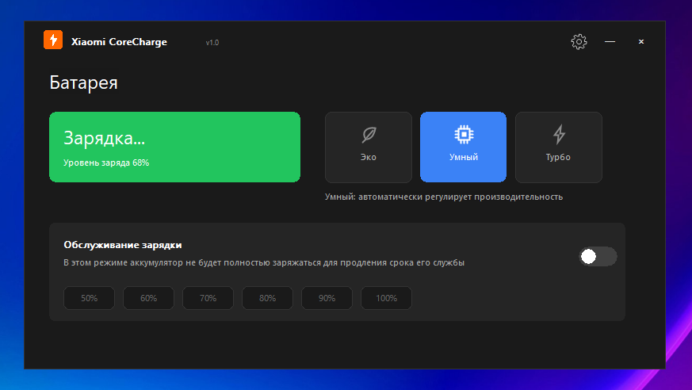

# Xiaomi CoreCharge

**测试适用机型: Redmibook Pro 14 2025 (Ultra 7 255H 32+1T) / Xiaomi Book Pro 14 2026 (Ultra x7 358H 32+1T)**

🚀 **[下载已编译的发布版本 (.zip)](https://github.com/alex-bogatiuk/Xiaomi-CoreCharge/releases/latest)** — 无需编译，直接运行。

## 简介
**Xiaomi CoreCharge** 是一款专为小米及红米笔记本设计的系统工具，用于管理硬件嵌入式控制器（Embedded Controller, EC）。该程序支持限制电池充电电量、切换 CPU 性能模式，并提供 Windows 系统托盘菜单集成与 OSD 屏幕指示功能。

该工具界面采用深色主题，并使用 GDI+ 矢量图形（抗锯齿/Anti-Aliasing）以保证控件的平滑显示。



---

## 主要功能

### 🔋 1. 电池保护 (Battery Care)
* **硬件限制**: 在 EC 控制器层级开启或关闭电池充电截断。
* **电量阈值**: 提供药丸状按钮，可快速将充电限制设定为 **50%, 60%, 70%, 80%, 90%, 100%**。
* **自动保存**: 更改充电限制时，设置将自动保存并应用。

### ⚡ 2. 性能模式切换
* **三种电源预设**:
  * 🌿 **节能模式 (Eco)**: 降低 CPU 频率及功耗，以实现静音运行。
  * 🧠 **智能模式 (Smart)**: 根据当前负载自动调节性能。
  * ⚡ **狂暴模式 (Turbo)**: 解锁 CPU 的最大热设计功耗（TDP）。
* **色彩标识**: 使用相应色彩高亮显示当前处于激活状态的模式。

### 🔔 3. 屏幕 OSD 指示 (OSD Layered Popup)
* 通过按钮、托盘菜单或全局快捷键切换模式时，屏幕正中会显示半透明的 OSD 提示窗口。
* **状态显示**: 在渐变背景上显示平滑的 GDI+ 矢量图标（节能叶片、智能芯片、狂暴闪电、电池状态）。
* **淡出效果**: 基于通道透明度（`UpdateLayeredWindow`）实现 OSD 窗口像素级的平滑渐变淡出。

### 🌐 4. 多语言支持 (Localization Engine)
* 界面文字、OSD 弹出信息、错误提示及系统托盘菜单已完整翻译为三种语言：
  1. **Русский** (俄语)
  2. **English** (英语)
  3. **中国** (中文)

### 💻 5. 系统集成
* **开机自启**: 将启动参数写入系统注册表，以实现 Windows 开机自动运行。
* **最小化到托盘**: 关闭程序时自动隐藏至系统托盘，保持后台持续监测。
* **高清图标**: 使用 `LoadImage` 结合系统度量指标（`SM_CXICON`/`SM_CXSMICON`）加载资源，防止图标在 Windows 任务栏或托盘中发生模糊。
* **无闪烁渲染 (Flicker-Free)**: 采用双缓冲（Double Buffering）与 `WS_CLIPCHILDREN` 窗口样式进行绘制，完全消除鼠标悬停时按钮的微闪烁现象。

---

## 全局快捷键

* **`Ctrl + Alt + P`**: 循环切换性能模式（`节能` ➔ `智能` ➔ `狂暴` ➔ `节能...`）并显示 OSD 提示。
* **`Ctrl + Alt + B`** (备用组合键: **`Ctrl + Alt + L`**): 开启或关闭电池保护模式并显示 OSD 提示。
  *(当 'B' 键被其他系统进程占用时，程序会自动注册备用键 'L')*。

---

## 编译与构建

### 系统要求:
* Windows 10 或 Windows 11 操作系统。
* Visual Studio 2022 / Build Tools 2026 (Toolset **`v145`** 或同等版本)。
* 端口访问驱动 **WinRing0x64.dll / WinRing0.dll**（须放置在可执行程序同级目录下）。

### 命令行构建 (MSBuild):
在 PowerShell 终端中执行以下命令以编译 Release 版本：
```powershell
& "C:\Program Files (x86)\Microsoft Visual Studio\18\BuildTools\MSBuild\Current\Bin\MSBuild.exe" xiaomi_corecharge.sln /p:Configuration=Release /p:Platform=x64 /p:PlatformToolset=v145
```
编译完成后的可执行文件将保存在：`x64\Release\xiaomi_corecharge.exe`。

---

## 注意事项
* **管理员权限**: 由于 `WinRing0` 驱动需要直接访问硬件 I/O 端口，程序必须以管理员身份运行。
* **兼容性**: 本工具适用于支持 EC 地址 `0x68` (性能) 和 `0xA4`/`0xA7` (电池) 的笔记本电脑。在不支持的硬件上运行时，程序将自动进入演示模拟模式。
* **兼容性验证**: 您可以使用 [通过 RWeverything 验证 EC 寄存器兼容性指南](EC_COMPATIBILITY_ZH.md) 来验证您的笔记本电脑型号是否兼容。

---

## 版权与致谢
* **WinRing0** — 硬件低功耗访问库，由 [OpenLibSys.org](http://openlibsys.org/) 开发（基于 BSD 许可证协议）。
* **参考仓库** — 本项目开发时参考了 [xiaomi_pc_manager_lite](https://github.com/CHHHHHHEN/xiaomi_pc_manager_lite/releases) 项目。
* 本项目仅供个人学习与研究使用，严禁用于任何商业用途。
